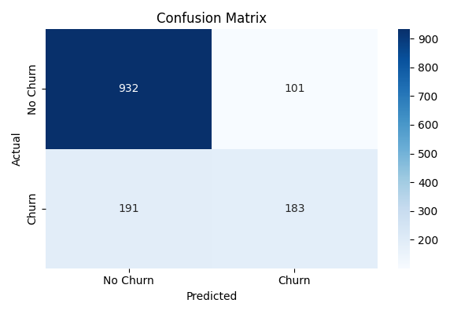

# 📉 Customer Churn Prediction App  

  
  
  

An **end-to-end Machine Learning project** for predicting **customer churn** using a **Streamlit web application**. This app lets users input customer details and get **real-time churn predictions** with probability scores and a prediction log.

---

## 🔍 Problem Statement

Customer churn occurs when customers stop using a company’s service. Retaining customers is crucial for subscription-based businesses.  

The goal of this project is to:
- Predict **whether a customer will stay or churn** based on their demographics and service usage.
- Provide a **simple web interface** to make predictions accessible for business users.
- Demonstrate an **end-to-end Machine Learning workflow**.

---

## 📊 Dataset Info

- **Dataset Name**: Telco Customer Churn  
- **Source**: [Kaggle Dataset](https://www.kaggle.com/blastchar/telco-customer-churn)  
- **Size**: 7043 rows × 21 columns  

### ✅ Key Preprocessing Steps
- Dropped `customerID` column.
- Converted `TotalCharges` to numeric and handled missing values.
- Applied **Label Encoding** for categorical features.
- Scaled numerical features using **StandardScaler**.

---

## ⚙️ Features Used for Prediction

| Feature Name       | Description                        |
|--------------------|-----------------------------------|
| gender             | Gender of the customer           |
| SeniorCitizen      | Whether the customer is a senior |
| Partner            | Has a partner                    |
| Dependents         | Has dependents                  |
| tenure             | Number of months with company    |
| Contract           | Contract type                    |
| InternetService    | Type of internet                 |
| PaymentMethod      | Payment method                   |
| MonthlyCharges     | Monthly billing amount           |
| TotalCharges       | Lifetime billing amount          |

---

## 🧠 Model Details

- **Algorithm**: RandomForestClassifier (scikit-learn)
- **Why Random Forest?**
  - Handles categorical and numerical data well
  - Good baseline accuracy and interpretability

### 🔬 Evaluation Metrics

| Metric     | Value  |
|------------|--------|
| Accuracy   | ~79%   |

**Confusion Matrix**:  


---

## 🖥️ Streamlit Web App

The app provides:

- **Sidebar Inputs**: Gender, Contract, Internet Service, Monthly Charges, etc.
- **Outputs**:
  - ✅ Prediction (Churn / Not Churn)
  - 📈 Churn Probability (e.g., 67.2%)
  - 🧾 Recent Predictions Log (`prediction_logs.csv`)

---

## 🖼 App Screenshot


---

## 🧰 Tools & Technologies Used

| Category           | Tools / Libraries         |
|--------------------|---------------------------|
| Language           | Python 3                 |
| ML Framework       | scikit-learn             |
| Web Framework      | Streamlit                |
| Data Handling      | pandas, numpy            |
| Visualization      | matplotlib, seaborn      |
| Model Persistence  | joblib                   |

---

## ▶️ How to Run This Project

```bash
# 1️⃣ Clone or Download the Repository
git clone https://github.com/yourusername/customer_churn_project.git
cd customer_churn_project

# 2️⃣ Create & Activate Virtual Environment (Recommended)
python -m venv venv
# On Windows:
venv\Scripts\activate
# On Mac/Linux:
source venv/bin/activate

# 3️⃣ Install Dependencies
pip install -r 03_requirements.txt

# 4️⃣ Run the Streamlit App
streamlit run 01_app.py
